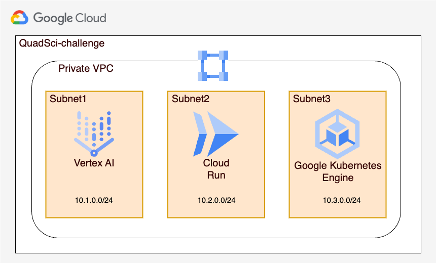

# GCP Infrastructure Project with Terraform

## Objective

The goal of this exercise is to set up a Google Cloud Platform (GCP) instance where we will be running and engineering our AI product. You must create a Terraform script that provisions the following resources within the provided GCP Project:

1. A Vertex AI instance with a Python kernel.
2. A Cloud Run Service, using the Docker image `crccheck/hello-world`.
3. A Dask cluster on Google Kubernetes Engine (GKE) to perform distributed data processing tasks. You can use Helm charts to deploy Dask or use Kubernetes manifests directly.

## Architecture

Given the project's focus, which involves components like Vertex AI, Cloud Run, and GKE, a microservices architecture could be a good option.

### Why Microservices?

- **Independent Scalability**: Each component (Vertex AI, Cloud Run, Dask) can be scaled independently according to load demands.
- **Independent Deployment**: Allows deploying and updating each service in isolation, minimizing the impact on other components.
- **Specific Technology**: Each service can use the most suitable technology for its needs. For example, Vertex AI can use Python, while Cloud Run can use Node.js or Go.
- **Resilience**: If one service fails, it does not necessarily affect other services.

### Proposed Architecture

#### Private VPC

Create a private VPC with dedicated subnets for each service:

- Subnet for Vertex AI.
- Subnet for Cloud Run.
- Subnet for the GKE cluster (Dask).

Configure routes to allow internal traffic between services and to the Internet (if necessary) through a NAT Gateway or egress rules.

#### Vertex AI

- Provision a Vertex AI instance with a Python kernel in the dedicated subnet.

#### Cloud Run

- Deploy the Cloud Run service using the `crccheck/hello-world` image in its dedicated subnet.

#### GKE (Dask)

- Create a private GKE cluster in its dedicated subnet.
- Implement the Dask cluster using Helm or Kubernetes manifests.

## Usage Instructions

1. Clone this repository.
2. Configure your GCP credentials.
3. Run the Terraform script to provision the resources.
